


CONTACT ME


I am a game developer with a professional focus on game design.
  For 8 years, I contributed to major AAA titles at Ubisoft Montreal and Ubisoft Bordeaux.
  I now direct my vision and creativity through Eleven Dusks Studios, an journey dedicated to solo game development.

	<iframe src="https://player.vimeo.com/video/1140467008?badge=0&amp;autopause=0&amp;player_id=0&amp;app_id=58479&amp;autoplay=1&amp;loop=1" frameborder="0" allow="autoplay; fullscreen; picture-in-picture; clipboard-write; encrypted-media; web-share" referrerpolicy="strict-origin-when-cross-origin" style="position:absolute;top:0;left:0;width:100%;height:100%;" title="Showreel";></iframe>

	Music: Nelumbra OST - Threshold by <a href="https://www.michaelboga.com/" target="_blank">Michael Boga</a>

[comment]: <> (SPACENAP)

<h1 style="font-size: 1.8em; color: #f0f0f0; font-weight: bold; text-decoration: underline; text-decoration-color: rgb(236, 0, 63);">Spacenap</h1>

<h1 style="font-size: .9em; color: #ffffff;">
	 
	Spacenap is a <b>chill clicker-idle desktop companion game.</b>
	 I developed the entire game on <b>Unreal Engine</b> and released it on <b>Steam</b>.
	

		 <i>Hunt and collect rare stars through 8 different galaxies.</i>
		 <i>Create constellations and discover more than 46 real and unique constellations.</i>
	

</h1>


STEAM PAGE


TRAILER


	

	  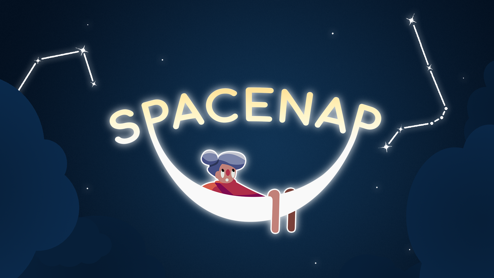
	

	

	  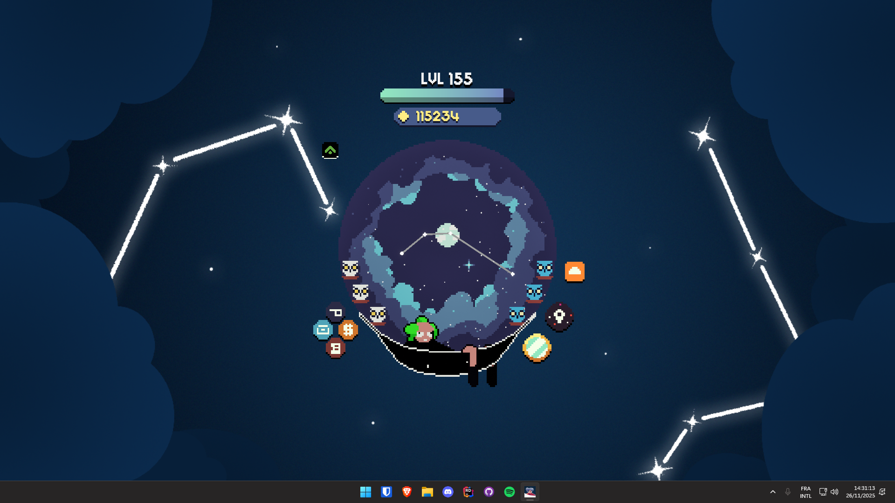
	

	

	  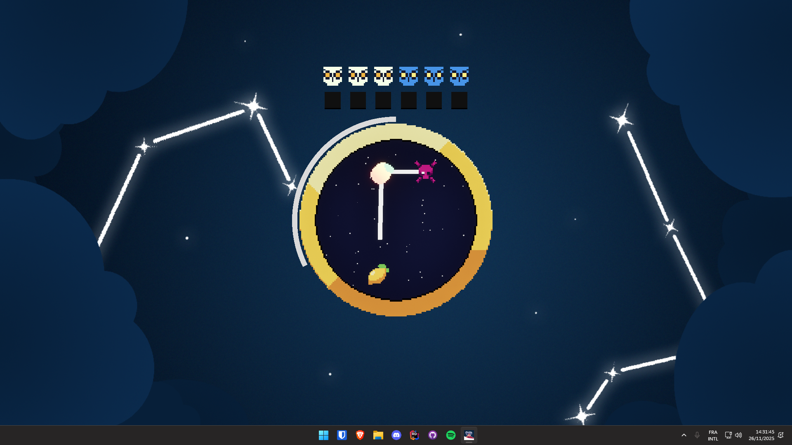
	

	

	  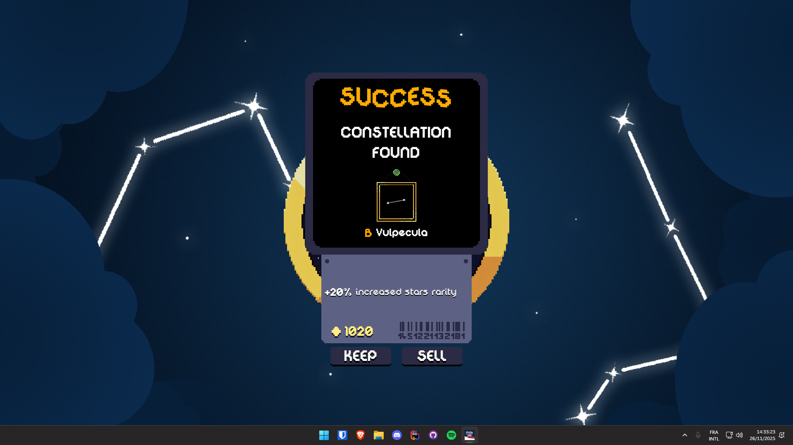
	

[comment]: <> (NELUMBRA)

<h1 style="font-size: 1.8em; color: #f0f0f0; font-weight: bold; text-decoration: underline; text-decoration-color: rgb(236, 0, 63);">Nelumbra</h1>

<h1 style="font-size: .9em; color: #ffffff;">
	 
	Nelumbra is a <b>2.5D roguelite time-survival game.</b>
	 I developed the entire game on <b>Unreal Engine</b> and released it on <b>Steam</b>.
	

		 <i>Play the Light Bearer, a savior trying to survive throughout timeloops.</i> 
		 <i>Discover a fresh and dynamic dash as well as a unique mechanic with lights constantly fading around.</i>
	

</h1>


STEAM PAGE


TRAILER


	

	  
	

	

	  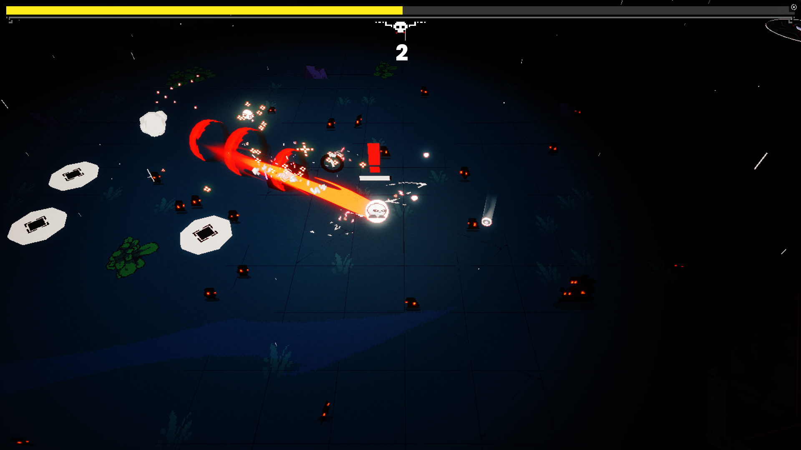
	

	

	  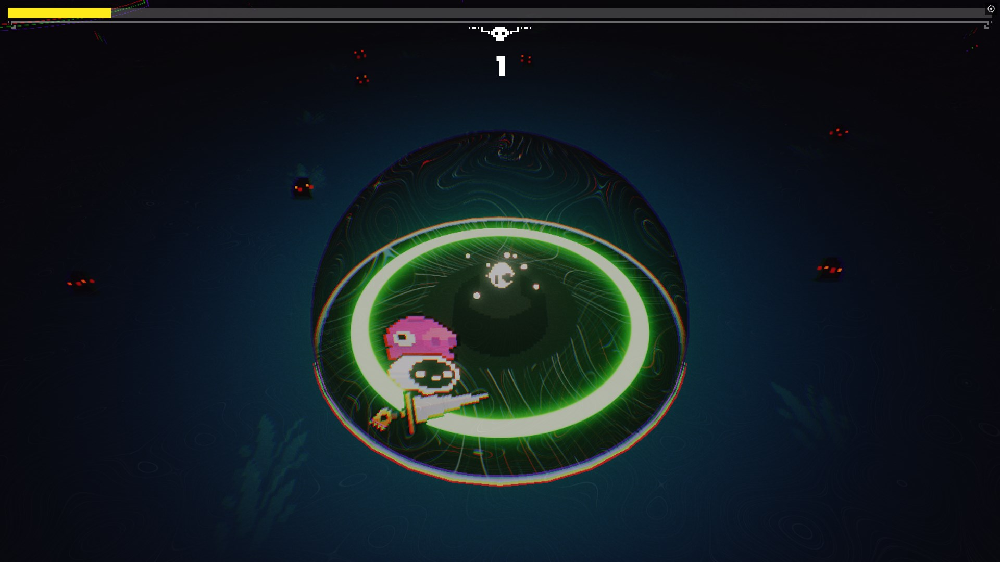
	

	

	  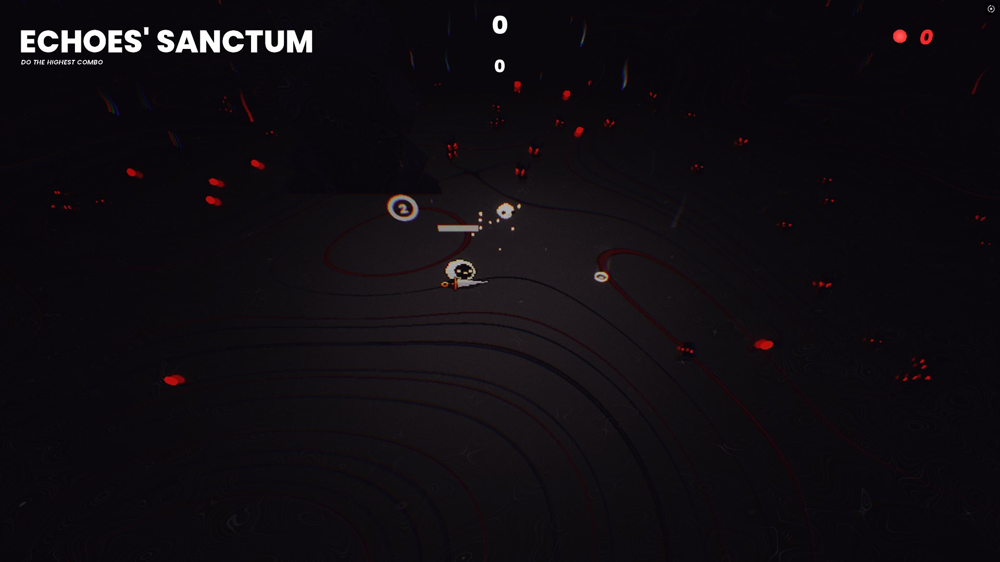
	

[comment]: <> (MONASTR)

<h1 style="font-size: 1.8em; color: #f0f0f0; font-weight: bold; text-decoration: underline; text-decoration-color: rgb(236, 0, 63);">Monastr</h1>

<h1 style="font-size: .9em; color: #ffffff;">
	 
	Monastr is a <b>free to play solo arcade mobile game</b>.
	 I developed the entire game on <b>Unreal Engine</b> and released it on <b>Android and iOS</b>.
	

		 <i>Control the Monk and his shield simultaneously to protect the Holy Flame.</i>
		 <i>Destroy waves of enemies and reach your highest score!</i>
	

</h1>


GOOGLE PLAY


TRAILER


	

	  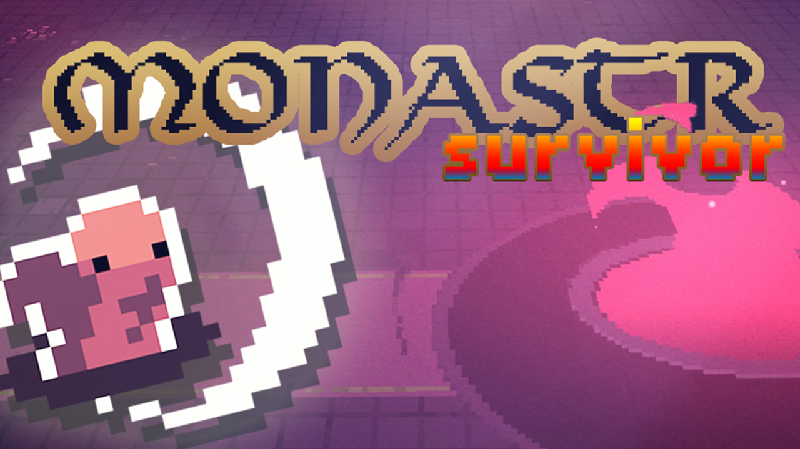
	

	

	  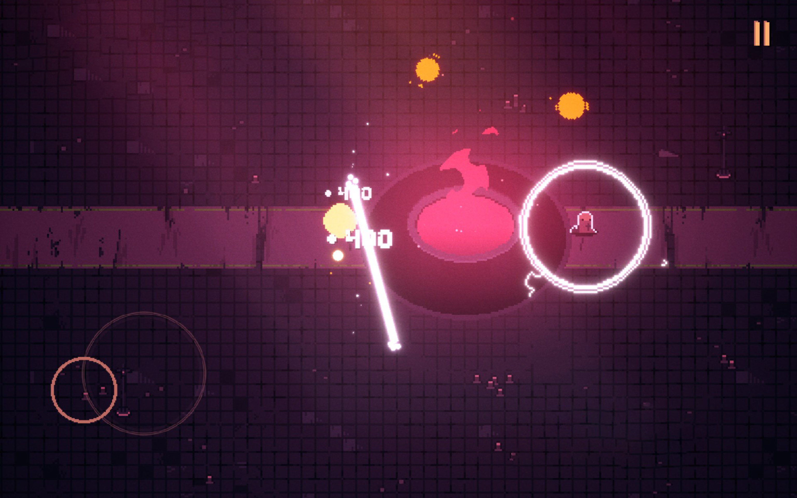
	

	

	  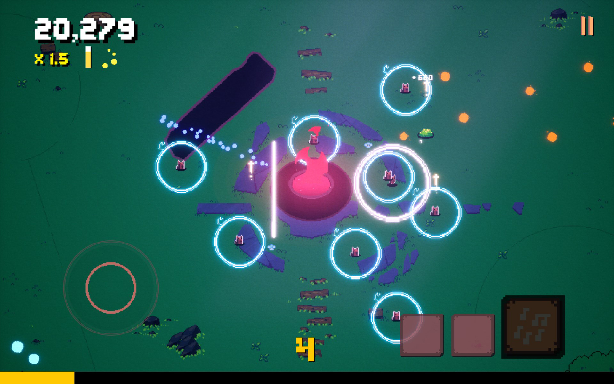
	

	

	  
	

[comment]: <> (HYPER SCAPE)

<h1 style="font-size: 1.8em; color: #f0f0f0; font-weight: bold; text-decoration: underline; text-decoration-color: rgb(236, 0, 63);">Hyper Scape</h1>

<h1 style="font-size: .9em; color: #ffffff;">
	 
	Hyper Scape was a <b>free to play fast-FPS battle royale game</b>.
	 I worked on it at Ubisoft Montreal as a <b>development tester</b> during the whole production.
	 It has been released on <b>PC, PlayStation and Xbox</b>.
	

		 <i>The main focus was dynamic and intensive shooting battles in the middle of Neo Arcadia.</i>
		 <i>Due to an overwhelmed market, we tried to innovate through different gameplay means, including the organic city's zones closure, allies' revival system or items quick looting.</i>
	

</h1>


TRAILER


GAMEPLAY


	

	  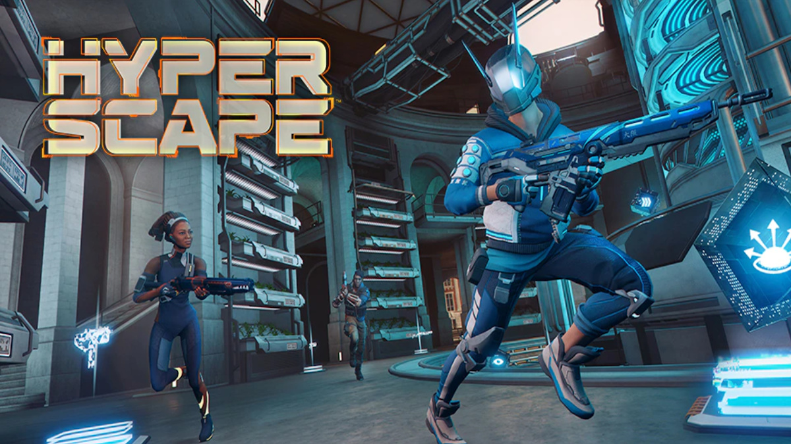
	

	

	  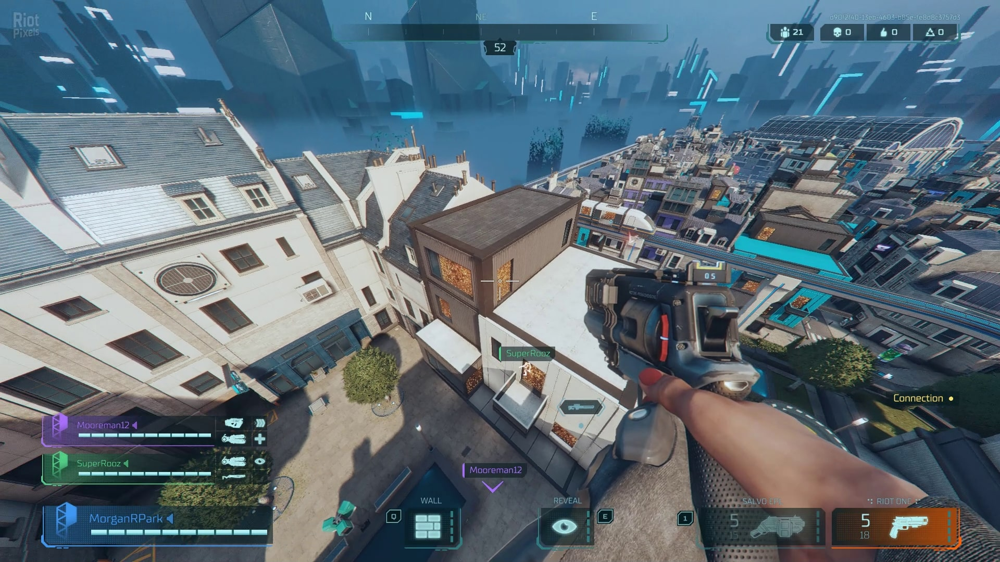
	

[comment]: <> (R6 SIEGE: OUTBREAK)

<h1 style="font-size: 1.8em; color: #f0f0f0; font-weight: bold; text-decoration: underline; text-decoration-color: rgb(236, 0, 63);">Rainbow Six Siege: Outbreak</h1>

<h1 style="font-size: .9em; color: #ffffff;">
	 
	Rainbow Six Siege: Outbreak was a <b>seasonal event, main feature of the Operation Chimera</b>.
	 I worked on it at Ubisoft Montreal as a <b>development tester</b>.
	 It has been released on <b>PC, PlayStation and Xbox</b>.
	

		 <i>Our goal was to design and develop cooperative missions, which later gave birth to Rainbow Six Extraction.</i>
		 <i>The event featured multiple maps with survival/zombie missions, 5 different AIs archetypes and other gameplay elements.</i>
	

</h1>


TRAILER


GAMEPLAY


	

	  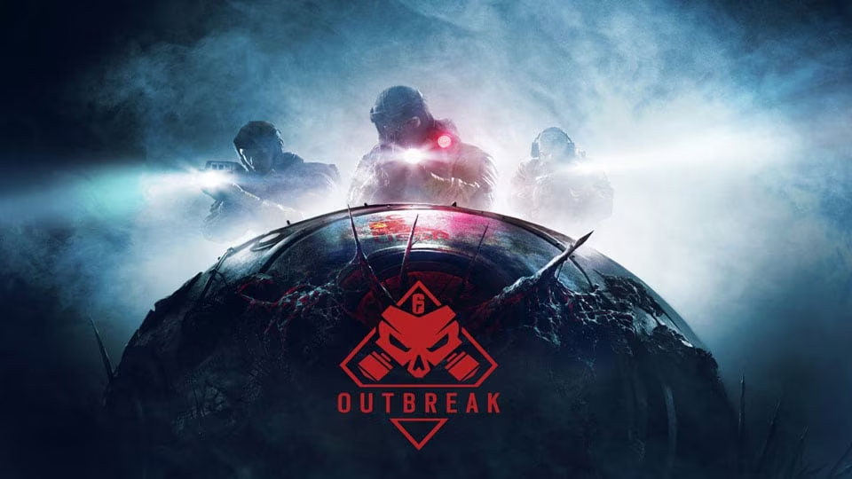
	

	

	  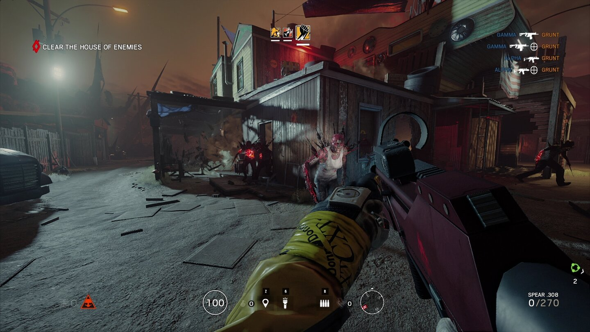
	

[comment]: <> (PROJECT Q)

<h1 style="font-size: 1.8em; color: #f0f0f0; font-weight: bold; text-decoration: underline; text-decoration-color: rgb(236, 0, 63);">Project Q</h1>

<h1 style="font-size: .9em; color: #ffffff;">
	 
	Project Q was a <b>free to play multiplayer TPS battle arena game</b>.
	 I worked on it at Ubisoft Bordeaux as a <b>development tester and game designer</b> during the whole production.
	 It is under NDA and has been cut.
	

		 <i>The main focus was to have quick fun with deep mechanics that could be dug while encouraging replayability.</i>
	

</h1>

	

	  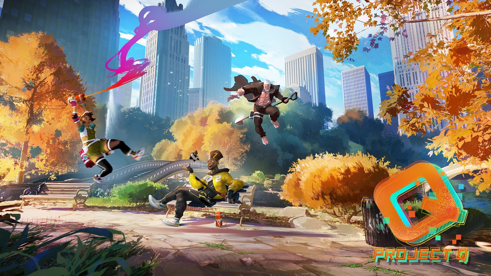
	

	

	  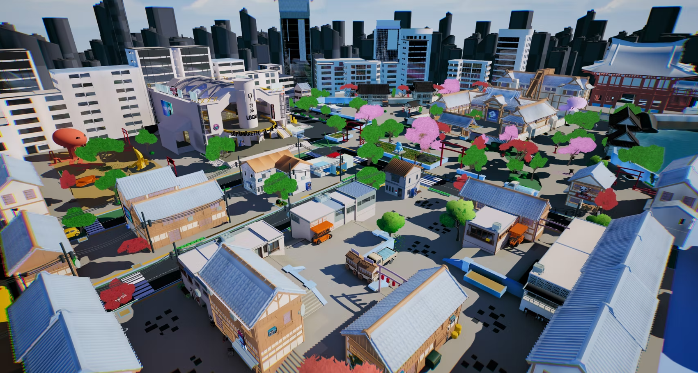
	

[comment]: <> (BATTLECORE ARENA)

<h1 style="font-size: 1.8em; color: #f0f0f0; font-weight: bold; text-decoration: underline; text-decoration-color: rgb(236, 0, 63);">BattleCore Arena</h1>

<h1 style="font-size: .9em; color: #ffffff;">
	 
	BattleCore Arena was a <b>free to play multiplayer competitive TPS game</b>.
	 I worked on it at Ubisoft Bordeaux as a <b>game designer</b> during the whole production.
	 It has been released on <b>Steam, Epic Games and Ubisoft Connect</b>.
	

		 <i>The game is based on physics-based movement and gameplay, aiming at quick and frenetic sessions for everyone.</i>
		 <i>Mixing Smash Bros. and shooters mechanics, players can eject their opponents by shooting, colliding, using abilities...</i>
	

</h1>


TRAILER


GAMEPLAY


	

	  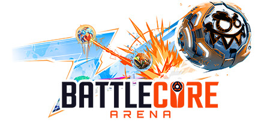
	

	

	  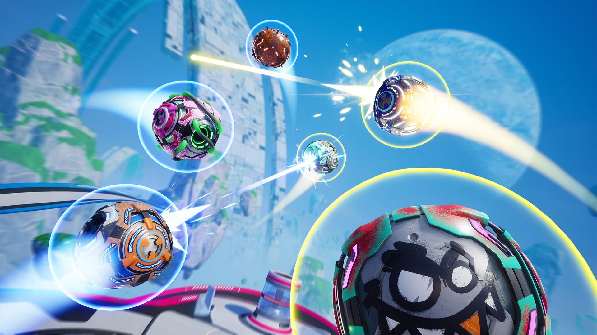
	

[comment]: <> (KINESIS)

<h1 style="font-size: 1.8em; color: #f0f0f0; font-weight: bold; text-decoration: underline; text-decoration-color: rgb(236, 0, 63);">Kinesis</h1>

<h1 style="font-size: .9em; color: #ffffff;">
	 
	Kinesis is a <b>student FPS puzzle game about reflexion and exploration</b>.
	 It was developed during our last year at ICAN Design using <b>Unity</b>.
	

		 <i>Player's journey starts on a strange living planet inspired by Moebius' universe.</i>
		 <i>Combining two mechanics (traveling inside flows and flows guidance with in-game ingredients), the goal is to explore the enviroment and understand its story.</i>
	

</h1>


* **Grand Prize** - Hits Playtime 2015
* **Nominated** - Game Critics (Montpellier In Game 2015)
* **Showcased at** - E3 2015 (BudGames), Geekopolis 2015 & Gaîté Lyrique



TRAILER


GAMEPLAY


	

	  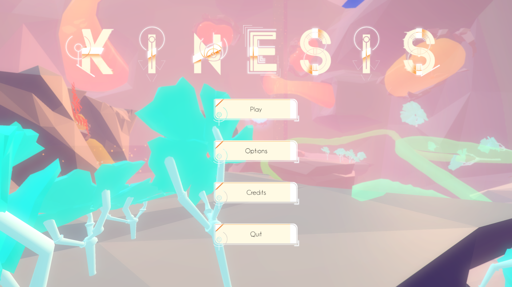
	

	

	  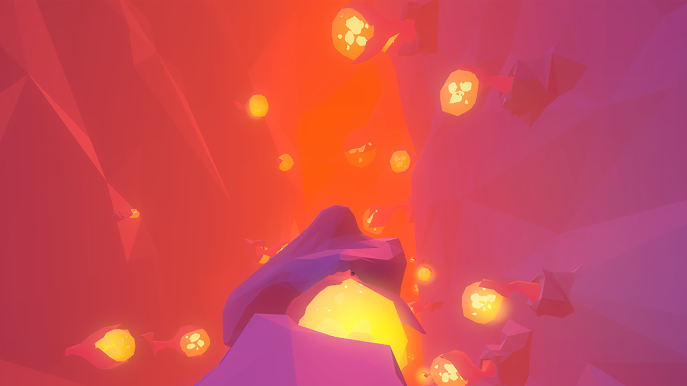
	

	

	  
	

	

	  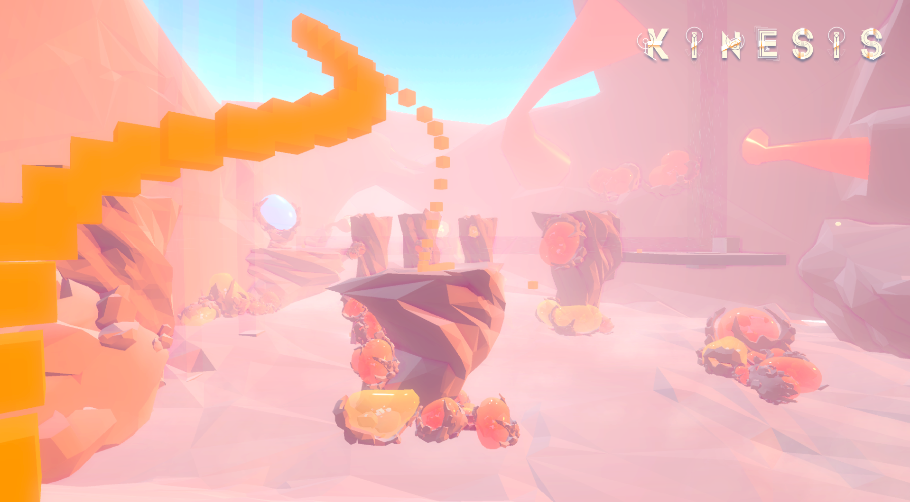
	

